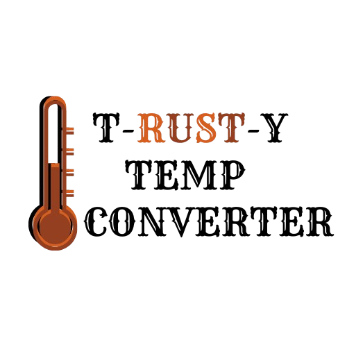

# Temperature Converter

 <!-- Optional: Add a logo -->

## Description

The Temperature Converter is a simple command-line application that converts temperatures between Fahrenheit and Celsius. It prompts the user to input the temperature unit ('f' for Fahrenheit or 'c' for Celsius) followed by the temperature value, then displays the converted temperature.

### Motivation

This project was created to provide a straightforward tool for users to convert temperatures easily, enhancing their understanding of temperature scales.

### Problem Solved

Many users need to convert temperatures for various applications, such as cooking, weather reporting, or scientific calculations. This program simplifies that process.

### What I Learned

Through this project, I learned about Rust's input/output handling, control flow with loops and match statements, and basic function definitions.

## Table of Contents

- [Installation](#installation)
- [Usage](#usage)
- [Features](#features)
- [Contributing](#contributing)
- [License](#license)
- [Acknowledgments](#acknowledgments)

## Installation

To run this project, ensure you have Rust installed on your machine. You can install Rust by following the instructions at [rust-lang.org](https://www.rust-lang.org/tools/install).

1. Clone the repository:
   ```bash
   git clone <repository-url>
   cd tempConverter
   ```

2. Build the project:
   ```bash
   cargo build
   ```

3. Run the application:
   ```bash
   cargo run
   ```

## Usage

When you run the program, it will prompt you to enter the temperature unit and value. For example:

Determine degrees in fahrenheit or celsius by entering 'f' or 'c' respectively followed by a space and the degrees.
f 100
You entered 100 degrees Fahrenheit.
Converted degrees: 37.77777777777778


## Features

- Converts temperatures from Fahrenheit to Celsius and vice versa.
- User-friendly command-line interface.
- Input validation for temperature unit and format.

## Contributing

Contributions are welcome! If you have suggestions for improvements or new features, please open an issue or submit a pull request.

## License

This project is licensed under the MIT License. See the [LICENSE](https://opensource.org/license/mit) file for details.

## Acknowledgments

- Thanks to the Rust community for their support and resources.
- Thanks to my cs Professor Cary Jardin for introducing me to this fun language!


